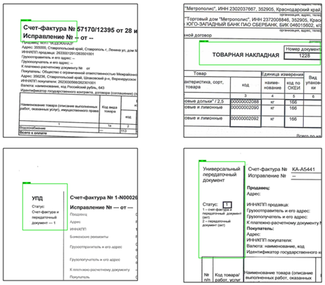
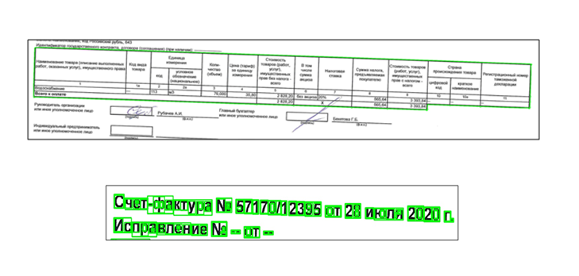
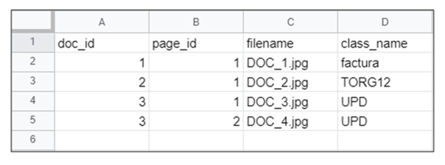

## This project implements the task "Automatic classification and assembly of scan-images of documents".

The project was created for sample documents of a particular company. The task of the program is to classify a set of pages of scanned documents and complete these pages for each multipage document.

Progress:

1. Сlassification of documents by key fragments and their location on the sheet.

2. Selection of the main tabular parts and symbols using contour analysis for the bundling algorithm.

3. Сollating all scanned sheets and creating a list of results.

